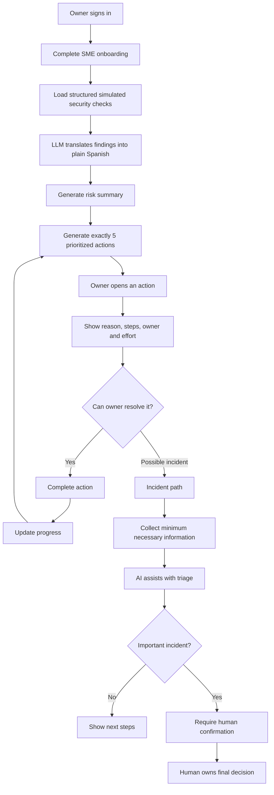
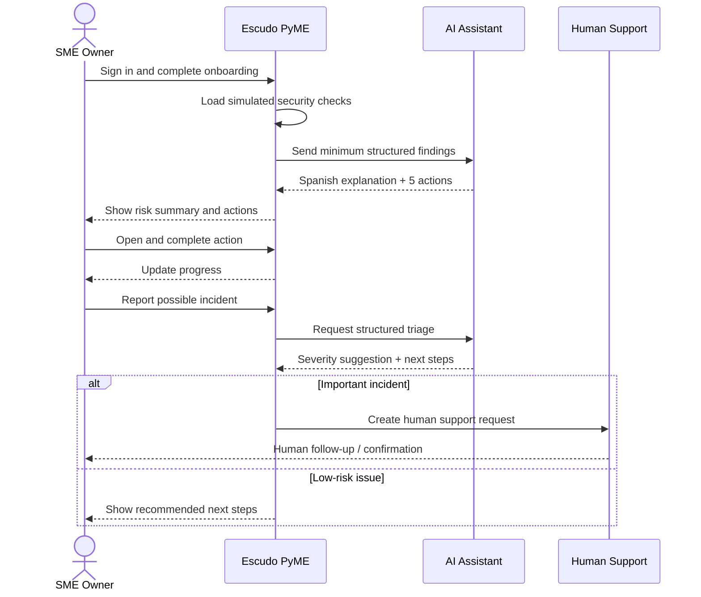

# PACKET — Week 8 Business Bending
## Escudo PyME

**Student:** Diego Gil  
**Team:** Team 1  
**Role:** Operator  
**Primary Vacuum:** SME Shield  
**Theme:** When the Tools Outrun the Safeguards

## 1. Problem in my words
Mexican SMEs depend on digital accounts, cloud tools, email, WhatsApp, laptops, and online banking, but many do not have a dedicated cybersecurity team. The operational gap is that an owner may not know which risks matter first, what action to take today, who should be responsible, or what to do when something suspicious happens.

Escudo PyME is a lightweight operating layer that turns structured security findings into exactly five prioritized actions, explains each action in plain Spanish, assigns responsibility, tracks progress, and provides a path to human support when automation should not decide. The value proposition is business continuity: reducing avoidable downtime, data loss, confusion, and recovery work.

## 2. Exact user
Owner or manager of a Mexican SME (roughly 1–50 employees), without a dedicated security team, with limited time and little cybersecurity vocabulary. They use tools such as WhatsApp, email, cloud software, laptops, and online banking and want clear actions rather than technical alerts.

### Language requirement
All academic and development documentation is written in English. The entire shipped product must be user-facing in clear Mexican Spanish, including navigation, onboarding, forms, errors, risk explanations, AI-generated recommendations, empty states, incident guidance, support requests, and disclaimers.

## 3. Success definition
Before the module closes, a user can:
1. Sign in securely.
2. Complete short SME onboarding.
3. Review structured simulated security checks.
4. Receive a simple Spanish risk summary.
5. Receive exactly five prioritized actions.
6. Open an action and understand what happened, why it matters, what to do, who owns it, and estimated effort.
7. Mark actions completed and see persistent progress.
8. Verify backup status.
9. Report a possible incident.
10. Escalate an important incident to a human-support path.
11. See what Escudo PyME does and does not protect.

Success means a nontechnical SME owner can finish onboarding and identify their first action without cybersecurity knowledge.

## 4. Image-generated mockup
The product mockup was generated before implementation. The dashboard is Spanish-first and centers on a simple current-risk state and exactly five prioritized actions.

Example:
- **Nivel de riesgo actual: MEDIO**
- **Tus 5 acciones prioritarias**
  1. Activar la verificación en dos pasos
  2. Configurar respaldos automáticos
  3. Revisar quién tiene acceso
  4. Actualizar dispositivos y programas
  5. Definir un plan de respuesta a incidentes

Each action shows plain-language steps, responsible owner, estimated effort, and a completion control. The interface never claims the business is completely safe.

## 5. Feature flow — Mermaid


## 6. Actor flow / swimlane


AI assists with explanation and triage; it never becomes the final owner of an important security decision.

## 7. Benchmark line
**UK — NCSC Cyber Essentials:** compresses baseline cybersecurity into a small, understandable set of controls. **Localization:** Escudo PyME turns the baseline into a Spanish-first workflow for Mexican SMEs centered on five immediate actions, continuity, ownership, and escalation rather than certification alone.

**Australia — small-business cyber support:** provides practical small-business security guidance and support. **Localization:** Escudo PyME makes the guidance an interactive operating workflow with prioritized actions and human escalation.

**Singapore — Cyber Essentials / SME support:** combines baseline expectations with an SME-support ecosystem. **Localization:** Escudo PyME assumes immediate value must come from clarity, reduced downtime, and recovery rather than relying on an equivalent certification/subsidy ecosystem.

## 8. Long view — three years
If this slice works, Escudo PyME becomes a lightweight security operating layer for Mexican SMEs rather than a one-time assessment. In three years it could continuously help businesses understand signals, coordinate remediation, maintain evidence of controls, manage incidents, and connect SMEs with qualified defenders when automation reaches its limit. It should remain understandable without turning visibility into surveillance or pretending software eliminates uncertainty.

## 9. Scope cut
Not building: antivirus, password manager, endpoint detection, malware/network scanning, penetration testing, employee monitoring or scoring, automated attribution, a SOC, a complete cybersecurity platform, autonomous production remediation, real personal breach intelligence, autonomous incident closure, or guarantees of complete safety.

## 10. Shadow clause
Collect only information required for the agreed actions. No employee browsing, keystrokes, private communications, unnecessary device activity, productivity monitoring, employee security scores, rankings, or surveillance profiles.

The UI must state: **“Escudo PyME reduce riesgos, pero ningún sistema puede garantizar seguridad total.”**

AI may summarize findings, translate technical language, prioritize baseline actions, and assist triage. AI may not declare a serious incident resolved, guarantee security, attribute an attacker, or make irreversible security decisions. Important incidents require human confirmation.

## 11. Dragon Stack
| Layer | Technology | Purpose |
|---|---|---|
| Frontend | Next.js + React | Spanish SME interface |
| Styling | Tailwind CSS | Responsive UI |
| Backend | Next.js server routes/actions | Application logic |
| Auth | Supabase Auth / Google | Protect user data |
| Database | Supabase Postgres | Businesses, actions, incidents |
| Authorization | Supabase RLS | User-only rows |
| LLM | OpenAI API | Spanish explanation and triage |
| Security data | Structured simulated findings | Reproducible assessment |
| Automation | Server/application workflows | Generate and track actions |
| Deployment | Vercel | Public deployment |
| Version control | GitHub | Development evidence |

Example simulated data:
```json
{
  "mfa_enabled": false,
  "backup_status": "manual",
  "inactive_accounts_reviewed": false,
  "device_updates": "partial",
  "incident_plan": false
}
```
The UI visibly labels it **Datos de demostración / evaluación simulada** and never implies real devices were scanned.

## 12. Data model
**Profile:** id, user_id, business_name, business_type, employee_range, created_at.  
**Assessment:** id, user_id, profile_id, simulated_findings, risk_level, created_at.  
**Action:** id, user_id, assessment_id, priority, title, explanation, steps, owner, estimated_effort, status.  
**Incident:** id, user_id, profile_id, category, description, severity_suggestion, human_confirmation_required, status, created_at.

RLS is enabled for every table containing user data.

## 13. Security floor
1. No secrets in source code or GitHub; environment variables only.
2. Protected routes require authentication, preferably Supabase Auth with Google.
3. RLS on every user-data table.
4. Validate required fields, type, max length, and allowed values. Never pass unrestricted raw text directly into an LLM prompt.
5. Demo data is invented; no real personal information.

## 14. Day-one operating model
**SME #1:** sign in → onboarding → simulated findings → five actions → work through actions → report incident if needed → important cases enter human support.

**SME #100:** automation handles onboarding, baseline assessments, routine explanation, action generation, progress tracking, and low-risk guidance. Humans are reserved for ambiguous/high-impact incidents, escalation, and final confirmation. This is the scaling boundary that preserves human responsibility.

## 15. Test plan
| Test | Action | Expected result |
|---|---|---|
| Authentication | Open protected route logged out | Redirect to sign-in |
| Onboarding | Submit valid profile | Profile created; assessment starts |
| Validation | Invalid/oversized fields | Clear Spanish error |
| Simulated assessment | Complete onboarding | Findings load and are labeled simulated |
| Five actions | Generate results | Exactly five prioritized actions |
| Action detail | Open recommendation | Reason, steps, owner, effort in Spanish |
| Completion | Mark action complete | Persistent status/progress |
| Incident | Report serious-looking incident | AI assists; human confirmation required |
| Shadow | Inspect data | No employee monitoring/scoring |
| False confidence | Complete all actions | No claim of complete safety |
| RLS | Access another user's records | Denied |
| Language | Walk full journey | All user-facing strings in Spanish |

## 16. Mechanical pass
Find at least one real bug during testing and document:
**Test → bug observed → diagnosis → fix → regression test → commit → redeploy.**
Do not invent the bug in advance.

## 17. Persona-test plan
Synthetic persona:
> You are Laura, 46, owner of a small distribution business in Mexico. You manage eight employees. You use WhatsApp, Gmail, online banking, and basic office software every day, but you do not work in technology. You are busy, skeptical of cybersecurity jargon, and silently stop using a product if you do not understand what it wants from you. Your main concern is keeping the business operating.

Provide screenshots in flow order. Ask her to explain each screen, choose the next click, narrate hesitation, identify unclear words, and say where she would quit. Log every confusion and fix the worst one before submission.

## 18. Load-bearing walls
1. Shipped UI is Spanish-first.
2. Built for a Mexican SME owner, not a security professional.
3. First result is exactly five prioritized actions.
4. Every finding leads to an understandable action.
5. Important incidents preserve human responsibility.
6. Minimum telemetry only.
7. No employee surveillance or scoring.
8. No claim of complete safety.
9. Simulated security data is visibly labeled.
10. The product sells continuity and clarity, not fear.
